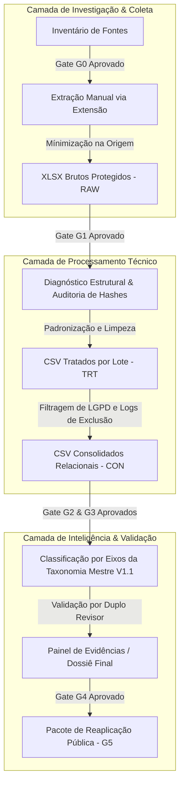

# MDN-RPP01-EXP-001-V0.1 — Experimento de Validação Metodológica do Mapa da Noite

Este documento formaliza a rodada **MDN-RPP01** como um experimento metodológico e empírico autônomo. Ele estabelece o rigor científico e técnico necessário para validar verticalmente o produto **Mapa da Noite** antes de sua posterior generalização e incorporação à arquitetura multidisciplinar **ALCATEIA**.

---

## 1. Objetivos do Experimento

O objetivo primordial deste experimento é comprovar a viabilidade técnica e a validade metodológica do pipeline de inteligência do **Mapa da Noite** (MDN). Especificamente, busca-se:
1. **Validar o processo de investigação do problema**: Comprovar que o recorte temático (relação comercialização vs. ética do cuidado no Tribal House de SP) é mapeável a partir de fontes públicas dispersas.
2. **Validar as fontes de evidência**: Avaliar se as 30 publicações pré-selecionadas no inventário protegido contêm dados de alta qualidade metodológica para responder à pergunta de pesquisa.
3. **Validar o pipeline de tratamento de dados**: Demonstrar a segurança, a fidelidade técnica e o respeito estrito à LGPD na transição entre dados brutos (`RAW`), bases estruturadas tratadas (`TRT`) e bases consolidadas relacionais (`CON`).
4. **Validar os agentes funcionais**: Medir o desempenho de agentes algorítmicos e humanos no processo de saneamento, classificação taxonômica e validação técnica.
5. **Identificar métricas de desempenho e qualidade**: Descobrir taxas de ruído, eficiência de filtros e acurácia de classificação automática.
6. **Registrar limitações, riscos e aprendizados**: Criar um repositório verificável de lições aprendidas para embasar decisões futuras da arquitetura.

---

## 2. Hipótese a Ser Validada

> **H_0 (Hipótese Metodológica Mestre)**:  
> *"É possível extrair, sanear, categorizar e interpretar sistematicamente percepções e tensões coletivas sobre a ética do cuidado e a comercialização na noite de São Paulo de forma 100% auditável, segura, livre de identificadores pessoais diretos e reproduzível por terceiros, sem que a automação técnica comprometa a fidelidade do contexto social observado."*

---

## 3. Escopo e Limitações

### Fronteira Temática e Espacial
- **Domínio**: Música eletrônica e espaços noturnos ligados à vertente Tribal House.
- **Geografia**: Município de São Paulo, SP, Brasil.
- **Período de Referência**: De 01 de junho de 2026 a 30 de junho de 2026, inclusive (janela unificada).

### Limitações Metodológicas Declaradas
- **Não representatividade estatística**: Os comentários extraídos representam exclusivamente manifestações de perfis públicos ativos nas fontes selecionadas, não podendo ser extrapolados para a totalidade dos frequentadores da cena.
- **Inexistência de nexo causal**: A frequência de menções a problemas (ex.: infraestrutura ou segurança) não constitui prova técnica de falha operacional ou de responsabilidade jurídica dos organizadores ou órgãos públicos.
- **Falta de dados demográficos diretos**: Por política estrita de privacidade e minimização prévia, não serão coletados ou inferidos gêneros, orientações, idades ou etnias dos autores das interações.

---

## 4. Fontes de Dados (Inventário MDN-RPP01-FON-PRO-001)

O experimento utiliza **30 publicações públicas específicas** do Instagram, selecionadas prospectivamente no inventário protegido [MDN-RPP01-FON-PRO-001-V0.1.csv](file:///c:/Users/Diego/Documents/Codex/2026-06-15/analise_comentarios_evento/20_rodada_prospectiva_padronizada_01/01_fontes_e_coleta/preenchidos/MDN-RPP01-FON-PRO-001-V0.1.csv), classificadas previamente nos seguintes contextos operacionais:
1. **Clubes Fechados (Indoor)**: Espaços tradicionais com controle acústico e infraestrutura fixa.
2. **Open Air (Ar Livre)**: Festivais, festas itinerantes e eventos em chácaras ou arenas abertas.
3. **Não Determinado**: Publicações de debate geral ou discussões temáticas que não se referem a um espaço específico.

---

## 5. Pipeline de Processamento (Linhagem de Dados)

O pipeline do experimento é rigorosamente linear e controlado por Gates de aprovação:

---

## 6. Agentes Envolvidos e Matriz de Responsabilidades

| Função Operacional | Agente Designado | Atribuição no Experimento |
|---|---|---|
| **Responsável da Rodada** | Diego da Silva | Coordenação geral, garantia de conformidade jurídica e técnica. |
| **Operador de Coleta** | Diego da Silva | Extração segura via extensão Chrome homologada nas 30 fontes. |
| **Responsável Metodológico** | Diego da Silva | Definição operacional das subperguntas, blindagens e linhagem. |
| **Responsável pela Proteção de Dados** | Diego da Silva | Execução de filtros LGPD, expurgo de e-mails/telefones e pseudonimização. |
| **Revisora Independente (G4)** | Kacia Oliveira | Auditoria externa cega das classificações e verificação de integridade de dados. |

---

## 7. Métricas de Sucesso do Experimento

Para comprovar a validade da rodada, serão rastreadas e publicadas as seguintes métricas quantitativas de engenharia de dados:

1. **Taxa de Integridade de Coleta (TIC)**:
   $$\text{TIC} = \left( \frac{\text{Fontes Coletadas com Sucesso}}{\text{Fontes Previstas (30)}} \right) \times 100\% \quad \text{[Meta: 100\%]}$$
2. **Taxa de Ruído Técnico (TRT)**:
   $$\text{TRT} = \left( \frac{\text{Registros Excluídos (Vazios / Duplicados / Spam)}}{\text{Total de Registros Brutos Coletados}} \right) \times 100\%$$
3. **Acurácia da Classificação Taxonômica (ACT)**:
   $$\text{ACT} = \left( \frac{\text{Classificações Confirmadas pela Revisora}}{\text{Total de Amostras Auditadas}} \right) \times 100\% \quad \text{[Meta: } \ge 90\%\text{]}$$
4. **Índice de Pseudonimização Segura (IPS)**:
   $$\text{IPS} = 100\% \quad \text{(Garantia de 0 vazamentos de nomes, IDs ou URLs reais nos produtos finais)}$$

---

## 8. Critérios de Aceitação para Homologação

A rodada **MDN-RPP01** só será homologada perante a banca técnica se atender integralmente às condições abaixo:
- [ ] **Rastreabilidade de Ponta a Ponta**: Cada linha na base consolidada deve possuir o hash e a linhagem reversível até o XLSX bruto protegido correspondente.
- [ ] **Conformidade de Minimização**: Zero registros contendo e-mails, números de telefone, URLs de perfis de comentaristas ou nomes reais nos arquivos finais.
- [ ] **Isolamento de Emojis**: Emojis isolados devem ser identificados como `fora_classificacao_textual` sem exclusão arbitrária de linhas.
- [ ] **Garantia de Revisão Humana**: Casos limítrofes, ambíguos ou que façam menção a termos sensíveis (risco à integridade física, assédio, etc.) devem ser sinalizados para decisão manual explícita.
- [ ] **Reprodutibilidade Externa**: Um terceiro independente deve ser capaz de reexecutar as análises a partir do pacote público de reaplicação (Fase 5) e obter os mesmos resultados agregados.

---

## 9. Evidências Produzidas

O sucesso do experimento será comprovado pela disponibilização dos seguintes artefatos físicos e verificáveis:
- **Diário de Coletas**: `MDN-RPP01-COL-001.csv` com hashes de todos os brutos.
- **Log de Saneamento**: Registro auditável de todas as linhas de ruído eliminadas.
- **Tabelas Relacionais Consolidadas**: Estrutura sem IDs que preserva o nexo analítico.
- **Matriz de Evidências Taxonômicas**: Classificação final indexada por eixos temáticos.
- **Relatório de Qualidade e Limitações**: Análise autocrítica do processo técnico.
- **Dossiê Jurídico e de Segurança**: Comprovação de conformidade legal e metodológica.

---

Este experimento metodológico serve como o alicerce empírico para o **Mapa da Noite**. Uma vez concluída e aprovada, a sistemática aqui validada será abstraída, generalizada e incorporada como um módulo central de inteligência da arquitetura corporativa **ALCATEIA**.
