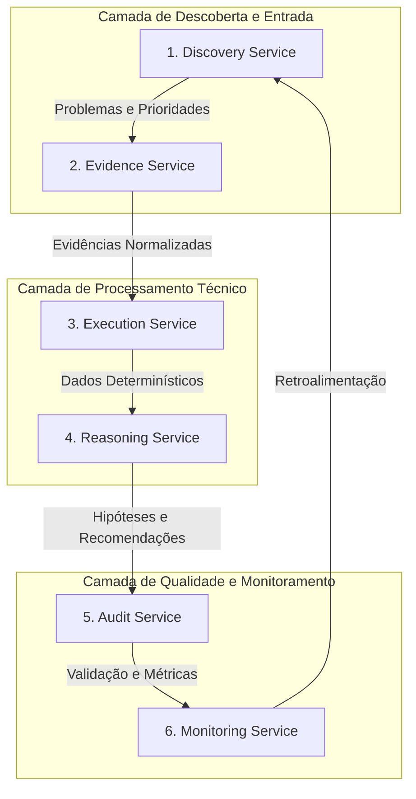

# ALCATEIA-ARC-001-V0.1 — Especificação da Arquitetura Multidisciplinar ALCATEIA

Este documento formaliza a arquitetura de software **ALCATEIA**. Desenvolvida como um núcleo tecnológico independente e agnóstico, ela foi estruturada para orquestrar pipelines de dados qualitativos complexos e auditoria de decisões apoiadas por Inteligência Artificial.

O produto **Mapa da Noite** (MDN-RPP01), após a completa homologação de sua rodada metodológica vertical, será integrado à ALCATEIA exclusivamente como um **Context Package** (Adaptador de Contexto), sem alterar o núcleo da arquitetura ou as bases protegidas da rodada prospectiva original.

---

## 1. Princípios da Arquitetura

1. **Separação Estrita de Responsabilidades**: Modelos de linguagem (LLMs) interpretam contextos; agentes determinísticos codificados (Codex) executam processamentos estruturais; regras estritas de software validam os resultados; operadores humanos autorizam e homologam decisões.
2. **Minimização de Dados por Design**: Nenhum dado pessoal direto (IDs de usuários, nomes, e-mails, telefones ou URLs de perfis) é incorporado ao núcleo de processamento ou versionado no Git.
3. **Cadeia de Evidências Imutável**: Toda recomendação, classificação ou diagnóstico gerado pela arquitetura deve estar atrelado de forma direta a um trecho textual de origem e a um hash criptográfico correspondente, permitindo rastreabilidade bidirecional reversível.
4. **Isolamento de Contexto**: Cada domínio de aplicação (ex.: vida noturna, mobilidade urbana, saúde pública) opera como um *Context Package* acoplável e desacoplável, possuindo taxonomia, regras de segurança e gates próprios.

---

## 2. O Modelo Único de Evidência (MUE)

Para garantir auditoria total, cada decisão ou classificação gerada pela ALCATEIA é encapsulada em um registro estruturado do **Modelo Único de Evidência** (MUE). 

```json
{
  "decision_id": "ALC-DEC-2026-XXXX",
  "context_package": "mapa_da_noite_v1",
  "fontes": [
    "FON-0001",
    "FON-0002"
  ],
  "evidencia_literal": "Trecho exato do comentário público do Instagram, livre de identificadores diretos.",
  "transformacoes": [
    "normalizacao_caracteres",
    "isolamento_emojis"
  ],
  "hashes": {
    "bruto_sha256": "hash_do_xlsx_original_correspondente",
    "evidencia_sha256": "hash_do_comentario_tratado"
  },
  "execucao": {
    "data_hora": "2026-07-21T04:30:00-03:00",
    "modelo_linguagem": "gemini-3.5-flash",
    "prompt_procedimento_id": "ALC-PRM-MDN-TAX-01",
    "prompt_sha256": "hash_do_prompt_ou_config_utilizado"
  },
  "incerteza": {
    "grau": "baixo",
    "justificativa": "Evidência explícita contendo gíria característica mapeada na taxonomia."
  },
  "aprovacao_humana": {
    "responsavel": "Diego Silva",
    "data": "2026-07-21",
    "assinatura_token": "token_verificavel_de_revisao"
  }
}
```

---

## 3. Os Seis Serviços Operacionais Core

A arquitetura ALCATEIA baseia-se em seis serviços independentes e interoperáveis:



### 1. Discovery Service (Descoberta e Priorização)
- **Função**: Identificar manifestações, gargalos ou temas emergentes e registrá-los em um inventário de priorização de problemas.
- **Regra**: Não analisa ou tira conclusões de percepção pública; apenas mapeia a necessidade de observação empírica de um domínio.

### 2. Evidence Service (Coleta e Preservação)
- **Função**: Executar extrações, validar cabeçalhos, remover identificadores diretos na origem e registrar as tentativas em diários oficiais.
- **Regra**: Gera hashes criptográficos (`SHA-256`) e garante que as 8 colunas obrigatórias da linhagem técnica estejam invioláveis.

### 3. Execution Service (Processamento Determinístico)
- **Função**: Executar rotinas lógicas fixas de saneamento, isolamento de emojis, remoção de duplicados e indexação relacional.
- **Regra**: Nunca usa modelos probabilísticos (LLMs). É executado por código estrito e gera logs de exclusão estruturados.

### 4. Reasoning Service (Raciocínio e Hipóteses)
- **Função**: Submeter os textos sanitizados do *Execution Service* a modelos de linguagem contextualizados para categorização taxonômica e formulação de hipóteses/recomendações.
- **Regra**: Não altera dados de origem e é obrigado a declarar o grau de incerteza operacional de cada inferência.

### 5. Audit Service (Auditoria e Integridade)
- **Função**: Verificar a consistência matemática e lógica entre a base bruta e a base consolidada, auditando a precisão inter-revisores.
- **Regra**: Bloqueia a transição de qualquer Gate de publicação se houver quebra de linhagem, hash divergente ou vazamento de dados confidenciais.

### 6. Monitoring Service (Monitoramento Pós-Decisão)
- **Função**: Acompanhar os indicadores de impacto resultantes de uma recomendação homologada e injetar novas evidências de feedback no pipeline.
- **Regra**: Cada indicador observado precisa ter seu período de medição e vínculo causal com a decisão original explicitamente documentados.

---

## 4. Orquestrador e Controle de Gates

O fluxo operacional da ALCATEIA é estritamente controlado por **Gates Compartilhados Bloqueantes**. Nenhum agente algorítmico tem permissão de auto-aprovação de status.

```
[Gate G0] --(Protocolo Formalizado)--> [Gate G1] --(Coleta Certificada)--> [Gate G2] --(Sanitização Concluída)--> [Gate G3] --(Análise e Raciocínio)--> [Gate G4] --(Validação Humana e Auditoria)--> [Gate G5] --(Publicação)
```

- **Aprovação de Gate**: Exige assinatura nominal e datada de um revisor humano no diário de decisões do núcleo.
- **Precedência de Regras**: Se um validador determinístico (Execution/Audit) acusar inconsistência em um hash de arquivo bruto, o fluxo é imediatamente congelado até resolução manual, ignorando quaisquer sugestões da LLM.

---

## 5. Integração do Adaptador "Mapa da Noite" (Fase 4)

O Mapa da Noite conecta-se à ALCATEIA como um pacote desacoplado de especificações:

1. **Taxonomia Adaptada**: Injeção da Taxonomia Mestre V1.1 (Congelada).
2. **Políticas de Proteção**: Regras de descarte seguro, retenção de 12 meses e pseudonimização estrita.
3. **Mapeamento de Fontes**: Inventário auditado de 30 fontes.
4. **Gates Específicos**: Critérios de acurácia de classificação ($\ge 90\%$) e integridade de coleta unificada de 1 a 30 de junho de 2026.

Esta arquitetura garante que a validade empírica e a metodologia do Mapa da Noite sejam mantidas intactas, servindo de prova concreta de que a ALCATEIA é uma arquitetura de inteligência genérica, reprodutível e robustamente validada na prática.
