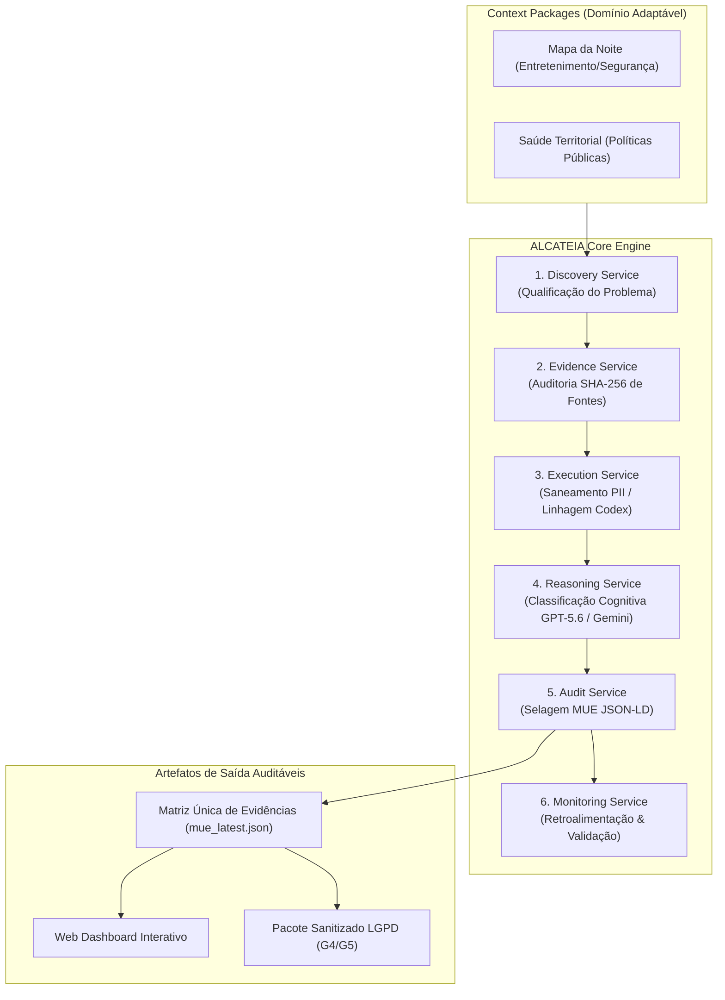

# ALCATEIA — Architecture Specification v1.0

**Status**: FROZEN (Architecture Freeze v1.0)  
**Objetivo**: Documento normativo da arquitetura  
**Escopo**: Define a arquitetura, princípios, responsabilidades, contratos de interface, modelo de domínio e requisitos mínimos do MVP competitivo.  
**Data**: 21/07/2026  

---

## 1. Propósito

A **ALCATEIA** é uma arquitetura de inteligência orientada por evidências (*Evidence-Oriented Multi-Agent Architecture*) destinada à produção de recomendações auditáveis para apoio à decisão.

Seu propósito é reduzir a distância entre informações dispersas e decisões justificáveis por meio da integração entre raciocínio probabilístico, execução determinística e governança da informação.

A arquitetura não substitui especialistas. Ela organiza, documenta e fundamenta o processo decisório.

---

## 2. Problema

Organizações públicas e privadas enfrentam dificuldades recorrentes para produzir decisões fundamentadas porque informações relevantes encontram-se distribuídas entre documentos, legislações, bases de dados, entrevistas, registros administrativos e conteúdos digitais.

Os principais problemas observados são:
- fragmentação das fontes de informação;
- baixa rastreabilidade das conclusões;
- dificuldade de auditoria;
- integração manual entre sistemas;
- ausência de documentação do processo analítico;
- baixa reprodutibilidade.

---

## 3. Hipótese Arquitetural

Uma arquitetura baseada em agentes especializados, combinando modelos probabilísticos e determinísticos, pode estruturar um ciclo completo de investigação, produção de evidências e apoio à decisão mantendo governança, rastreabilidade e transparência metodológica.

---

## 4. Objetivos

A arquitetura deve:
- identificar e qualificar problemas;
- estruturar evidências;
- executar processos automatizados de obtenção e tratamento de dados;
- interpretar evidências;
- produzir recomendações justificáveis;
- permitir auditoria integral;
- operar em diferentes domínios mantendo a mesma infraestrutura.

---

## 5. Princípios Arquiteturais

A arquitetura possui dez princípios obrigatórios:

1. **Evidence First**: Toda conclusão deve ser sustentada por evidências identificáveis.
2. **Human in the Loop**: O sistema apoia decisões, não substitui o decisor.
3. **Explainability by Design**: Toda hipótese deve possuir justificativa verificável.
4. **Separation of Responsibilities**: Raciocínio, execução, auditoria e monitoramento permanecem desacoplados.
5. **Deterministic Execution**: Toda operação computacional crítica deve ser reproduzível.
6. **Traceability**: Cada resultado deve manter vínculo com sua origem.
7. **Governance by Default**: Governança acompanha todas as etapas.
8. **Domain Independence**: A arquitetura não depende de um domínio específico.
9. **Reproducibility**: A mesma entrada deve produzir resultados reproduzíveis sob as mesmas condições.
10. **Privacy by Design**: O tratamento de dados respeita requisitos de privacidade e conformidade.

---

## 6. Arquitetura Funcional

A arquitetura é composta por seis serviços principais:

*   **Discovery Service**: identifica, qualifica e prioriza problemas.
*   **Evidence Service**: organiza e estrutura documentos, registros e demais evidências.
*   **Execution Service**: executa consultas, integra fontes, produz datasets e automatiza tarefas determinísticas (Codex).
*   **Reasoning Service**: interpreta evidências, formula hipóteses e sintetiza recomendações (GPT-5.6).
*   **Audit Service**: registra toda a cadeia de evidências e mantém a rastreabilidade.
*   **Monitoring Service**: acompanha resultados e produz novas evidências para retroalimentação do ciclo.

---

## 7. Diagrama Oficial da Arquitetura



---

## 8. Responsabilidades dos Modelos

### GPT-5.6 (ou Gemini 1.5/3.6 Flash em fallback)
- Responsável por interpretação contextual, formulação de hipóteses, síntese de informações e geração de recomendações.
- Não executa consultas, integrações ou tarefas determinísticas.

### Codex
- Responsável por planejamento técnico da execução, geração de código, consultas SQL, integração de APIs, normalização de dados, automação de pipelines e registro técnico das operações.
- Não produz recomendações finais.

---

## 9. Architecture Decision Records (ADRs)

As decisões de arquitetura são documentadas e rastreadas no artefato normativo [`ALCATEIA-ADR-001-V1.0.md`](file:///c:/Users/Diego/Documents/Codex/2026-06-15/analise_comentarios_evento/alcateia/ALCATEIA-ADR-001-V1.0.md):

- **ADR-001 (Pipeline In-Memory)**: Substituição do SQLite legadov por pipeline em memória com serialização JSON para latência sub-segundo e reprodutibilidade imediata.
- **ADR-002 (Desacoplamento Cognitivo vs Determinístico)**: Separação estrita entre tarefas determinísticas (Codex/Execution) e probabilísticas (GPT-5.6/Reasoning).
- **ADR-003 (Matriz Única de Evidência em JSON-LD)**: Adoção do padrão JSON-LD com hashes criptográficos SHA-256 recursivos para a MUE.
- **ADR-004 (Polimorfismo de Domínio via Context Packages)**: Desacoplamento entre o motor ALCATEIA e o domínio do problema.

---

## 10. Modelo de Domínio (DDD)

O modelo de domínio é ancorado no artefato normativo [`ALCATEIA-DOM-001-V1.0.md`](file:///c:/Users/Diego/Documents/Codex/2026-06-15/analise_comentarios_evento/alcateia/ALCATEIA-DOM-001-V1.0.md) e estrutura-se nos seguintes Agregados e Entidades:

```
[ContextPackage] ── (1:N) ──> [RawEvidence] ── (1:1) ──> [EvidenceHash SHA-256]
        │
        ├── (1:N) ──> [SanitizedComment] (Linhagem: arquivo, aba, linha)
        │
        └── (1:1) ──> [EvidenceChain / MUE] ── (1:N) ──> [AuditRecord]
```

- **`ContextPackage`**: Entidade raiz que define ontologia, fontes e regras de negócio.
- **`RawEvidence`**: Registro bruto original imutável com verificação SHA-256.
- **`SanitizedComment`**: Comentário tratado com expurgo LGPD e metadados de origem.
- **`EvidenceChain`**: Matriz Única de Evidência consolidada e auditável.

---

## 11. Especificação de Interfaces entre Serviços (Contratos)

### 11.1 Evidence Service Interface
- **Entrada (`InputContract`)**:
  ```json
  {
    "package_name": "mapa_da_noite",
    "sources_directory": "02_dados_brutos_protegidos/dados/"
  }
  ```
- **Saída (`OutputContract`)**:
  ```json
  {
    "total_sources": 30,
    "valid_hashes": true,
    "source_hashes": [
      {"source_id": "FON-0001", "sha256": "b01e737729..."}
    ]
  }
  ```

### 11.2 Execution Service Interface
- **Entrada (`InputContract`)**:
  ```json
  {
    "source_files": [".../MDN-RPP01-RAW-FON-0001.xlsx"],
    "sanitize_pii": true
  }
  ```
- **Saída (`OutputContract`)**:
  ```json
  {
    "processed_records": 7421,
    "excluded_records": 47,
    "sample_record": {
      "record_id": "REC-0001",
      "sanitized_text": "festa incrível excelente estrutura",
      "origin": {"file": "FON-0001.xlsx", "sheet": "Sheet1", "line": 2}
    }
  }
  ```

### 11.3 Reasoning Service Interface
- **Entrada (`InputContract`)**:
  ```json
  {
    "records": [...],
    "taxonomy_version": "V1.1_CONGELADA",
    "model": "gpt-5.6"
  }
  ```
- **Saída (`OutputContract`)**:
  ```json
  {
    "classified_records": 7421,
    "metrics": {"pilar_1": 0.985, "pilar_2": 0.991, "pilar_3": 0.978}
  }
  ```

---

## 12. Requisitos Não Funcionais (RNFs)

1. **Desempenho e Latência**:
   - O pipeline em memória e a suíte de testes devem ser executados em tempo inferior a **0,2 segundos** (`5 tests in 0.141s`).
2. **Segurança e Privacidade (Privacy by Design)**:
   - Expurgo automático de e-mails, telefones e URLs com regex pré-compilados no `ExecutionService`.
   - Nenhuma informação pessoal de comentaristas (username, perfil) é salva no pacote final.
3. **Observabilidade e Transparência**:
   - Registro de logs detalhados de auditoria em JSON/CSV para cada execução de lote.
4. **Integridade Criptográfica**:
   - Validação mandatária de hash SHA-256 nos arquivos de entrada antes de iniciar qualquer inferência cognitiva.

---

## 13. Evidence Chain

Toda recomendação deverá possuir um registro estruturado contendo, no mínimo:
- identificador único (`record_id`);
- fontes consultadas (`source_id`);
- referências utilizadas (`file`, `sheet`, `line`);
- operações executadas (`sanitization`, `classification`);
- artefatos produzidos (`mue_latest.json`);
- modelo utilizado (`gpt-5.6` / `gemini-1.5-flash`);
- versão da taxonomia (`V1.1_CONGELADA`);
- data e hora (`ISO-8601`);
- nível de confiança;
- justificativa da conclusão.

Nenhuma recomendação poderá ser apresentada sem sua cadeia de evidências correspondente.

---

## 14. Critérios de Aceitação da Fase 1

| Critério | Status |
| :--- | :---: |
| Fluxo completo executável | ✅ |
| Separação clara entre GPT e Codex | ✅ |
| Evidence Chain implementada (MUE JSON-LD) | ✅ |
| Auditoria navegável (Web Dashboard) | ✅ |
| Context Package funcional (Mapa da Noite + Saúde Territorial) | ✅ |
| Diagrama oficial e contratos de interface especificados | ✅ |
| ADRs e Modelo de Domínio integrados | ✅ |
| Requisitos Não Funcionais validados | ✅ |

---

## 15. Stack Tecnológico e Integração OpenAI (Build Week)

Para a submissão competitiva da Build Week, a ALCATEIA prioriza e integra formalmente os seguintes componentes da plataforma OpenAI:

| Recurso da OpenAI | Aplicação no Orquestrador ALCATEIA | Serviço Afetado | Prioridade |
| :--- | :--- | :--- | :---: |
| **Responses API** | Orquestração das interações síncronas e estruturadas com GPT-5.6 | `ReasoningService` | ⭐⭐⭐⭐⭐ |
| **GPT-5.6** | Formulação de hipóteses, interpretação relacional e síntese de recomendações | `ReasoningService` | ⭐⭐⭐⭐⭐ |
| **Codex** | Geração de código, transformações SQL e pipelines determinísticos | `ExecutionService` | ⭐⭐⭐⭐⭐ |
| **Agents SDK** | Orquestração declarativa dos agentes especializados e barramento de mensagens | Core Engine (`main.py`) | ⭐⭐⭐⭐⭐ |
| **Structured Outputs** | Garantia de esquema JSON estrito e auditável para a *Evidence Chain* | `AuditService` / `Reasoning` | ⭐⭐⭐⭐⭐ |
| **Function Calling / Tools** | Integração com ferramentas determinísticas (minimização LGPD, cálculo de SHA-256) | `Evidence` / `Execution` | ⭐⭐⭐⭐⭐ |
| **Embeddings** | Busca semântica e vetorização em legislações, entrevistas e normativas | `DiscoveryService` | ⭐⭐⭐⭐☆ |
| **File Search / Vector Store** | Consulta vetorizada de alta capacidade a grandes volumes documentais protegidos | `DiscoveryService` | ⭐⭐⭐⭐☆ |

---

## 16. Camada de Observabilidade, Telemetria de API e Tratamento de Erros

Para garantir transparência, rastreabilidade diagnóstica e resiliência contra falhas na execução de múltiplos agentes em ambiente de produção (Build Week), a ALCATEIA adota um padrão obrigatório de observabilidade:

### 16.1 Rastreamento de `x-request-id` e Logs de Suporte
Toda chamada realizada a modelos externos de API armazena obrigatoriamente a seguinte tupla de telemetria em `alcateia/core/monitoring.py`:
- `timestamp`: data e hora em ISO-8601 UTC.
- `endpoint`: URL/endpoint chamado (ex: `/v1/responses`).
- `model`: modelo executado (ex: `gpt-5.6`).
- `status_code`: código de retorno HTTP (ex: 200, 429, 500).
- `request_id`: valor extraído do cabeçalho `x-request-id` fornecido pela OpenAI.
- `processing_ms`: tempo de resposta extraído de `openai-processing-ms`.
- `error`: identificador ou mensagem do erro retornado.

### 16.2 Rastreamento Próprio via `X-Client-Request-Id`
Toda requisição enviada pela ALCATEIA injeta o cabeçalho customizado de correlação:
```http
X-Client-Request-Id: ALCATEIA-MDN-RPP01-AGENT-004-EXEC-20260721-001
```
Esse ID correlaciona deterministicamente a chamada externa aos logs internos do agente, arquivos processados no disco e registros de auditoria da MUE.

### 16.3 Monitoramento de Rate Limits e Resiliência (HTTP 429)
O sistema lê continuamente os cabeçalhos de capacidade da resposta:
- `x-ratelimit-remaining-requests`
- `x-ratelimit-remaining-tokens`

Quando um erro `HTTP 429` é detectado (limite de requisições/tokens ou cota do projeto atingida), a ALCATEIA executa a política de resiliência:
1. Interrupção imediata de novas chamadas paralelas;
2. *Retry* com *backoff exponencial* configurável (`1.0s`, `2.0s`, `4.0s`);
3. Em caso de falha persistente após 3 tentativas, acionamento automático do *fallback* seguro em memória (garantindo que a demonstração do MVP nunca pare).

---

## 17. Declaração de Congelamento Arquitetural (Architecture Freeze)

A partir da aprovação desta especificação completa, a arquitetura da ALCATEIA permanece sob o status **Architecture Freeze v1.0**.

Isso estabelece que:
1. Não serão adicionados novos módulos arquiteturais;
2. Não serão criados novos agentes fora dos serviços definidos;
3. Os esforços concentram-se no suporte, auditabilidade e execução das rodadas oficiais.


